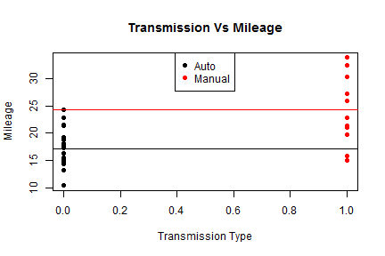
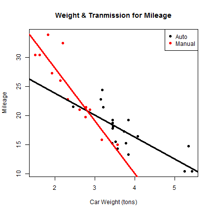
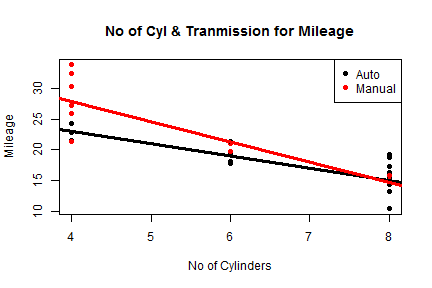

Car Mileage
========================================================
author: Avranil Ghosh
date: 26-Apr-2015

Overview
========================================================

With rising fuel prices, mileage has become a very important criteria for selection of car in today's world. However the transmission option - Manual and 
auto is also one of the key comfort features that customers are definitely looking for. In this project we will try to investigate the following points:

- Mileage given by some 32 automobiles (1973 to 1974 models) as available in dataset mtcars and compare it with the transmission option of the cars 
- Try to provide some inferential analysis based on Liner Models which can help customers decide on the best choice of their car. 
- Overview of the App built and deployed for this analysis

Summary of Mileage in Cars dataset in R
========================================================

 
<small>
If we plot the average mpg for all the cars based on their Transmission option, we clearly see that manual cars have average mpg of 24.3923077 while 
automatic cars give an average of 17.1473684. This is clearly seen in the above Ploti. However this conclusion will not be sufficient if we disregard the other factors like weight, disp, etc.</small>

Predicting with Linear Models
========================================================

 

***

 

***

<small>
We see that for lower weight cars with less cylinders, manual transmission will give more mileage whereas for higher weight cars above 3 ton with 8 
cylinders, auto transmission gives more mileage.</small>

Features of the App
=======================

We had analyzed the model till now with only 3 predictors : No of Cylinders, Weight and Type of Transmission.
However there are other important specifications like Horsepower, Displacement, Number of Gears which may also affect the outpput Mileage.

The App deployed in Shiny for this project will allow the user to change all of the important specifications of a car like Number of cylinders, 
displacement,weight, horsepower,number of gears in the App through Drop downs, sliders and Input Text Boxes. Based on the input selection the App will give 
the predicted mileage based on GLM prediction model on the mtcars dataset.

The App can be accessed from the link:
http://avranil.shinyapps.io/Coursera
